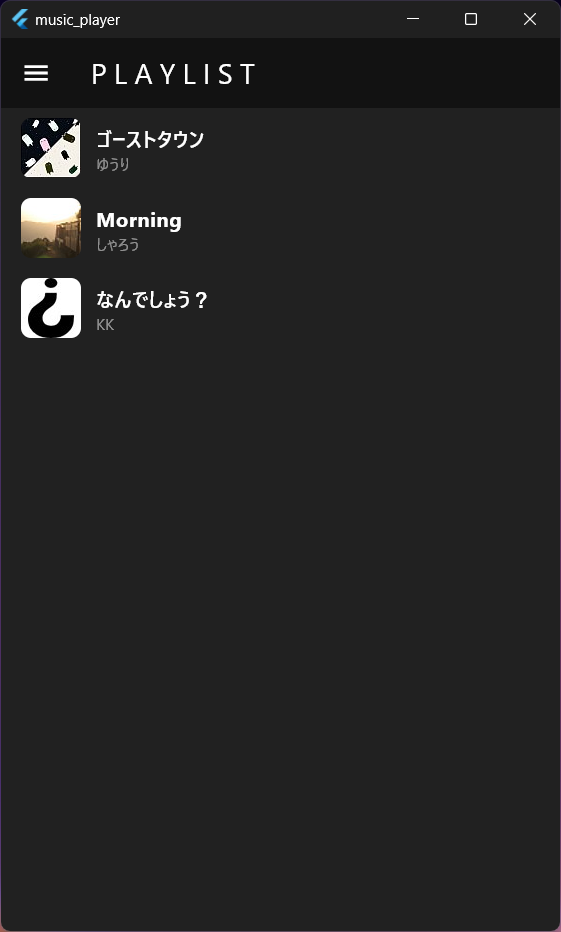
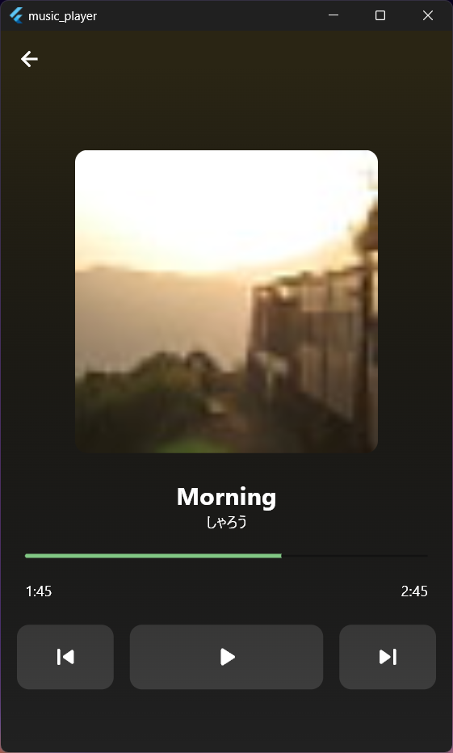

# Music Player 

Flutterで開発した、音楽プレーヤーアプリです。

Providerを使用して、アプリの状態管理を意識して開発を行いました。

## スクリーンショット

下記のZIPを展開すると、実行ファイル（exe）があります。※Windows x64向け
> zip/windows.zip

アプリに使用している音源は、「DOVA-SYNDROME」からダウンロードしたものを使わせていただいております。
